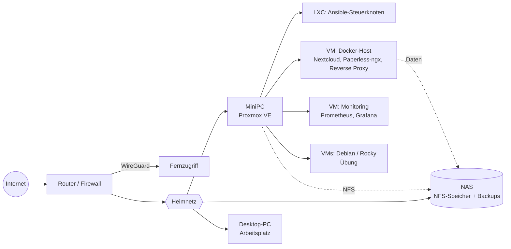

# Homelab

Proxmox-Homelab als Code: vom Bare-Metal-Host bis zur automatisierten, überwachten Umgebung mit CI.
Alles, was sich als Code ablegen lässt, liegt in diesem Repo – nichts wird von Hand eingerichtet.


## Überblick

| Bereich | Werkzeuge |
|---|---|
| Virtualisierung | Proxmox VE (bare metal), VM-Templates mit cloud-init |
| Betriebssysteme | Debian 12, Rocky Linux 9 |
| Automatisierung | Ansible (Rollen, Ansible Vault) |
| Container | Docker, Docker Compose, Reverse Proxy mit TLS (eigene CA) |
| Monitoring | Prometheus, node_exporter, Grafana, Alertmanager |
| Backup | Proxmox Backup aufs NAS, getestete Wiederherstellung |
| CI | GitHub Actions: ansible-lint, shellcheck |

## Netzplan

> Schematisch – echte IP-Adressen und Hostnamen stehen bewusst nicht im Repo.



## Hardware

| Gerät | Rolle |
|---|---|
| MiniPC | Proxmox-Host für alle VMs und Container |
| NAS | Speicher (NFS) und Backup-Ziel |
| Desktop-PC | Arbeitsplatz, Git, SSH |

## Repo-Struktur

```
homelab/
├── README.md        # dieser Überblick
├── docs/            # Doku je Modul + Runbooks
├── ansible/         # Inventory, Playbooks, Rollen
├── docker/          # Compose-Dateien je Dienst
├── monitoring/      # Prometheus-, Grafana-Konfiguration
└── scripts/         # Bash- und Python-Skripte
```

## Stand

| # | Modul | Zeitraum | Status | Ergebnis |
|---|---|---|---|---|
| 1 | Fundament und Git | Woche 1–3 | ✅ fertig | Proxmox läuft, NAS eingebunden, Repo online – [Doku](docs/01-fundament.md) |
| 2 | Linux-Fundament | Woche 4–7 | 🟡 in Arbeit | VM-Templates per Skript – [Doku](docs/02-linux.md) |
| 3 | Automatisierung mit Ansible | Woche 8–11 | ⚪ offen | neue VM in < 10 Min. per Playbook |
| 4 | Container mit Docker | Woche 12–15 | ⚪ offen | Nextcloud + Paperless-ngx mit TLS |
| 5 | Monitoring | Woche 16–19 | ⚪ offen | Grafana-Dashboard, Alarme per Mail |
| 6 | Backup, Restore und CI | Woche 20–26 | ⚪ offen | getesteter Restore, GitHub-Actions-Pipeline |

Legende: ✅ fertig · 🟡 in Arbeit · ⚪ offen

## Gelernt

<!-- Je Modul 2–3 Sätze: Welches Problem trat auf, wie wurde es gelöst? -->

- **Modul 1:** Proxmox ohne Subscription aktuell halten, NAS per NFS einbinden, Git-Workflow mit Branch und Pull Request.
- **Modul 2:** Templates mit cloud-init; Skripte brechen bei Fehlern sofort ab, statt still weiterzulaufen.

## Sicherheit

- Keine Passwörter, Schlüssel oder internen IP-Adressen im Repo.
- Geheimnisse werden mit Ansible Vault verschlüsselt.
- Fernzugriff nur über WireGuard, keine offenen Ports.
